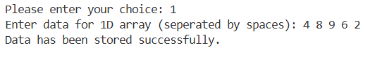
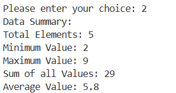
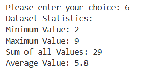
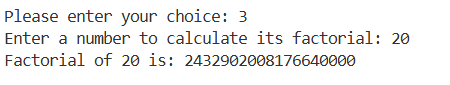
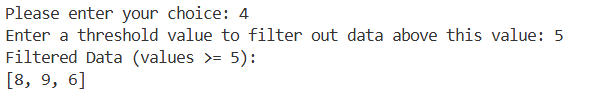
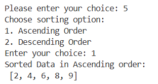
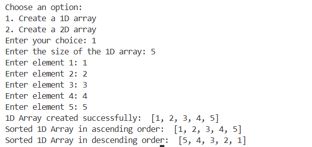
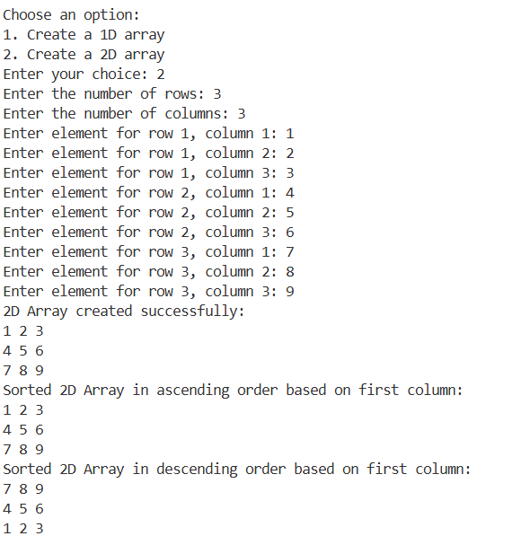

# 📊 Functional Treat: Data Analyzer & Transformer

A high-level Python application designed to manipulate and analyze data within one-dimensional (1D) and two-dimensional (2D) arrays (lists). This project showcases advanced programming concepts including functional tools, recursion, and complex data structure management.

## 🎯 Project Objective
The goal is to provide a versatile, menu-driven interface that allows users to perform various data analysis and transformation tasks. It serves as a demonstration of proficiency in Python's core and functional features.

---

## 🚀 Technical Highlights
This project implements the following advanced Python features:
* **Functional Programming:** Utilization of `lambda` (anonymous) functions and `filter()` for dynamic data processing.
* **Recursion:** Implementation of mathematical recursion for factorial calculations.
* **Flexible Arguments:** Use of `*args` and `**kwargs` for robust function definitions.
* **Documentation:** Extensive use of `__doc__` strings for in-code function documentation.
* **Data Structures:** Sorting and transforming both 1D and 2D list-based collections.

---

## 📸 Program Walkthrough

### 1. Data Initialization
The program starts by allowing users to input raw data for analysis.

* **1D Data Entry:** Enter integers separated by spaces to populate the primary array.

### 2. Statistical Summaries
Generate real-time insights from your stored data.

* **Summary Module:** View total elements, min/max values, sums, and averages instantly.

* **Combined Statistics:** A single function call that returns multiple statistical metrics simultaneously.

### 3. Mathematical Power
* **Recursive Factorials:** Calculate factorials of large integers using recursive logic.

### 4. Data Transformation & Filtering
* **Lambda Filtering:** Prune your dataset based on custom thresholds using functional programming.

* **Sorting Suite:** Organize data in ascending or descending order with a single choice.
 

---

## 📂 Specialized Array Modules
Beyond the main menu, the program features dedicated modules for handling different array dimensions.

### 1D Array Creation & Sorting
Manually define the size and elements of a 1D array with automatic sorted previews.

### 2D Array (Matrix) Operations
Create complex matrices and sort them based on specific columns using lambda keys.

---

## 🛠️ Requirements & Usage
* **UI:** A modern `match-case` menu-driven interface.
* **Exit Logic:** Clean exit functionality from the main menu.
* **Execution:** Run via terminal using `python Functional_treat.py`.

---

